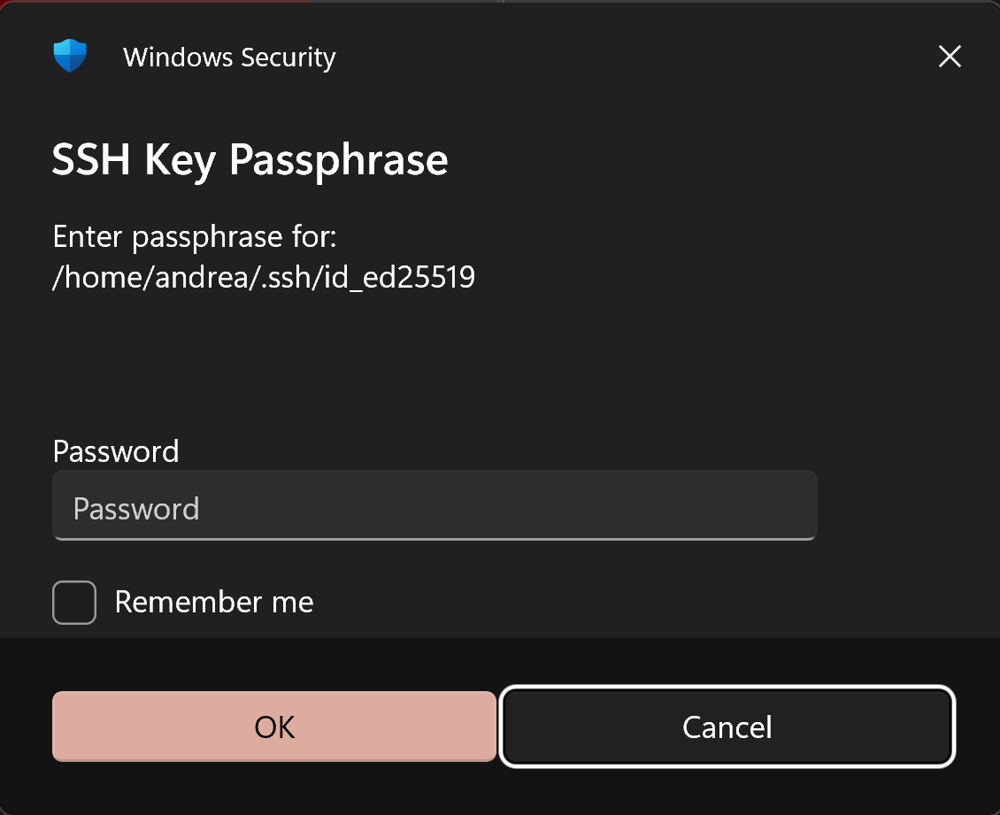

[](https://crates.io/crates/winaskpass)

# winaskpass

A Rust CLI tool that serves as an ssh-askpass helper for WSL (Windows Subsystem for Linux). It securely stores SSH key passphrases in the Windows Credential Manager so you don't have to re-enter them repeatedly.



## Installation and building

### WSL

By default this project uses PowerShell with embedded C# to call Windows APIs (credui.dll, advapi32.dll) since this runs in WSL.

`cargo install` can be used to install in `~/.cargo/bin/`:

```sh
cargo install winaskpass
```

To build from the repository, use:
```sh
git clone https://github.com/ilpianista/winaskpass.git
cd winaskpass
cargo build --release --locked
```

### Windows

`WinGet` can be used to install in `%PATH%`:

```
winget install winaskpass
```

When built natively uses Windows APIs directly, build with the `native` feature and the `x86_64-pc-windows-msvc` target:

```sh
git clone https://github.com/ilpianista/winaskpass.git
cd winaskpass
cargo build --release --no-default-features --features native --target x86_64-pc-windows-msvc
```

## Setup

To make `ssh` use `winaskpass` set `SSH_ASKPASS=/path/to/winaskpass` or `SSH_ASKPASS=/path/to/winaskpass.exe` depending on your choice.

`SSH_ASKPASS_REQUIRE=prefer` might be required as well.

Then invoke `ssh-add </dev/null`.

## Donate

Donations via [Liberapay](https://liberapay.com/ilpianista) or Bitcoin (1Ph3hFEoQaD4PK6MhL3kBNNh9FZFBfisEH) are always welcomed, _thank you_!

## License

MIT
